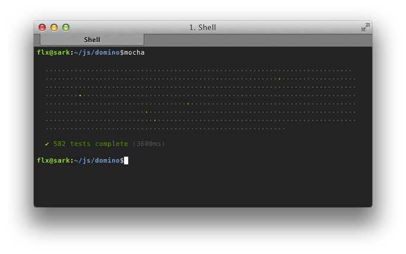

# Server-side DOM implementation based on Mozilla's dom.js

## Simplicity over Isolation

In contrast to the original [dom.js](https://github.com/andreasgal/dom.js) project, domino was not designed to run untrusted code. Hence it doesn't have to hide its internals behind a proxy facade which makes the code not only simpler, but eventually also more performant.

## Speed over Compliance

Domino is intended to _build_ pages rather than scraping them. Hence compatibility with existing code out in the wild is not a primary goal.

## Designed for Node

As the name might suggest, domino's goal is to provide a <b>DOM in No</b>de. The library is organized in CommonJS modules and doesn't require any additional build steps. Domino doesn't use any harmony features like proxies or WeakMaps and will also run in older Node versions. It's written in pure JavaScript and doesn't require any native extensions.

## CSS Selector Support

Domino provides support for `querySelector()` and `querySelectorAll()` backed by the [Sizzle](http://sizzlejs.com/) selector engine.

## Usage

    var domino = require('domino');

    var window = domino.createWindow('<h1>Hello world</h1>');
    var document = window.document;

    var h1 = document.querySelector('h1');
    console.log(h1.innerHTML);

## Tests

Domino includes test from the [W3C DOM Conformance Suites](http://www.w3.org/DOM/Test/)
as well as tests from [HTML Working Group](http://www.w3.org/html/wg/wiki/Testing).

The tests can be run using [Mocha](http://visionmedia.github.com/mocha/):

## License and Credits

The majority of the code was written by [Andreas Gal](https://github.com/andreasgal/) and [David Flanagan](https://github.com/davidflanagan) as part of Mozilla's dom.js project. Please refer to the included LICENSE file for the original copyright notice and disclaimer.
